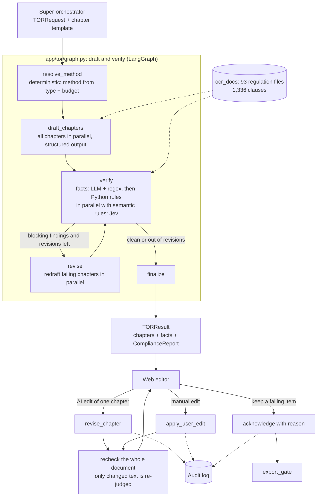

# DraftTOR Agent: TOR drafting and procurement-compliance checking

[](https://www.python.org/downloads/)
[](https://github.com/langchain-ai/langgraph)
[](https://opensource.org/licenses/MIT)

DraftTOR Agent drafts Thai government Terms of Reference (ร่างขอบเขตของงาน, TOR) and checks them against procurement law (พ.ร.บ.การจัดซื้อจัดจ้างและการบริหารพัสดุภาครัฐ พ.ศ. ๒๕๖๐ and ระเบียบกระทรวงการคลังฯ ๒๕๖๐). It is one workflow in a Procurement Agentic SaaS: a **super-orchestrator** sends it the project details and the chapter template, and it returns the drafted chapters together with a compliance report.

The pipeline does two jobs:

1. **Write** each chapter the template asks for.
2. **Verify** the whole document against a rule registry in which every rule is tied to a clause in the regulation corpus. Users then edit the document in the web app. The system re-checks after every edit and reports problems, but never overrides the user. Any blocking finding the user chooses to keep must be acknowledged with a reason, and that acknowledgement is audit-logged.

> TOR drafting lives in `app/tor/`. The Memo and Meeting Agenda pipelines in `app/graphs/` are separate and unchanged.

---

## Architecture



### Components

| Module | Responsibility |
|---|---|
| [app/tor/schemas.py](app/tor/schemas.py) | Contracts: `TORRequest` (input from the orchestrator), `TORTemplateSpec` / `TemplateChapter`, `DraftChapter`, `TORFacts`, `Finding`, `ComplianceReport`, `TORResult` |
| [app/tor/procurement.py](app/tor/procurement.py) | Chooses the procurement method (e-bidding / e-market / specific / selection) deterministically. Models never decide legal thresholds. |
| [app/tor/regulations.py](app/tor/regulations.py) | Splits the OCR corpus into clauses (`มาตรา` / `ข้อ`). Exact clause lookup supports citations; character-trigram BM25 supplies drafting context. Thai text has no word boundaries, so trigrams avoid needing a tokenizer. |
| [app/tor/drafting.py](app/tor/drafting.py) | Drafts each chapter as JSON validated by Pydantic. All money arithmetic runs in Python: the LLM proposes BOQ categories and weights, and the code allocates the budget exactly. Fact extraction uses the LLM with a regex backstop. |
| [app/tor/checks.py](app/tor/checks.py) | Rule runner and the deterministic checks. `verify()` runs fact extraction at the same time as semantic judging. |
| [app/tor/jev_judge.py](app/tor/jev_judge.py) / [app/services/jev_client.py](app/services/jev_client.py) | Semantic-rule judge using the TypeSafe [Jev](https://openrouter.ai/typesafe/jev-1.13) decision model on OpenRouter's `/api/alpha/decisions` endpoint. Each list item or sentence is a batched `choice` question answered with softmax probabilities. |
| [app/tor/concurrency.py](app/tor/concurrency.py) | Process-wide limit of 4 concurrent model requests (the rest queue), parallel map, and per-unit verdict cache. |
| [app/tor/rules/tor_rules.yaml](app/tor/rules/tor_rules.yaml) | Rule registry: severity, scope (procurement type and method), citation, `verified` flag, parameters, judge thresholds. |
| [app/tor/service.py](app/tor/service.py) | Operations after generation: `revise_chapter`, `apply_user_edit`, `recheck`, `acknowledge`, `export_gate`, `AuditLog`. |

### Compliance rules

| Kind | Rules | How it is checked |
|---|---|---|
| Internal consistency | chapters complete, no fallback text, BOQ total equals budget, installments total 100%, installments ordered and within the contract duration | Pure Python |
| Legal, numeric | daily penalty rate (ระเบียบฯ ข้อ ๑๖๒), contract bond 5–10% (ข้อ ๑๖๘), subcontracting penalty ≥ 10% (มาตรา ๙๕), wording consistent with the procurement method (มาตรา ๕๕) | Facts extracted, then checked in Python |
| Legal, semantic | no brand or vendor lock in specifications (มาตรา ๙); vendor qualifications proportionate to the work (มาตรา ๘) | **Jev decision model.** Each list item or sentence is judged separately, with the exact clause text, the agency's requirements and the project budget as shared context. The probability of a violation maps to `fail` (≥ 0.7) or `needs_human` (≥ 0.4). |
| Pending expert sign-off | reference-work value ≤ 50% of budget; budget cap for the specific method | Report `needs_human`; never `fail` |

**Design principles**

- **Every rule cites a real clause.** A unit test confirms each citation resolves to a clause in `ocr_docs`.
- **Unverified rules cannot block.** Until a procurement expert sets `verified: true`, a rule can report `needs_human` but never `fail`.
- **Missing data is never a silent pass.** If a required fact is absent, the check reports `warn`. If the extractor or the judge is unavailable, it reports `needs_human`.
- **Evidence is always real text from the draft.** Each semantic finding's evidence is the exact item or sentence that was judged.
- **Probability thresholds instead of yes/no.** Thresholds are set per rule in the registry, and each finding includes its `confidence`.
- **Users stay in charge after generation.** A user's edits are re-checked and reported, never auto-corrected. Exporting with blocking findings requires an `acknowledge` with a reason, recorded in the audit log.

---

## Usage

**From the super-orchestrator:** call `draft_and_verify_tor(TORRequest)` from `app.tor`. The request contains:

- the project details: name, agency, budget, duration and raw requirements;
- the procurement type;
- optionally, the procurement method. If it is omitted, the method is resolved deterministically.
- a `TORTemplateSpec`, which lists the chapters. Each chapter has an `id`, `title`, `kind` (`text`, `list`, `boq` or `payment_schedule`), optional `instructions`, and a `required` flag.

The call returns a `TORResult` containing the structured chapters, the extracted facts, and a `ComplianceReport`. Each finding in the report has `rule_id`, `status`, `evidence`, `suggestion`, `citation` and `confidence`.

**After generation (web editor):** all four functions are in `app.tor`.

| Function | When to use it |
|---|---|
| `revise_chapter(result, chapter_id, instruction, actor)` | The user asks the AI to change one chapter. Other chapters stay as they are, and the whole document is re-checked. |
| `apply_user_edit(result, chapter, actor)` | The user edits a chapter by hand. The whole document is re-checked; the result is advisory only. |
| `export_gate(result)` | Returns the blocking findings that have not been acknowledged. An empty list means the document can be exported. |
| `acknowledge(result, finding_keys, actor, reason)` | The user accepts responsibility for specific findings. A reason is required. |

The audit log is written to `data/audit/<document_id>.jsonl` as one event per line: `generated`, `ai_revision`, `user_edit`, `acknowledge`. In production, replace it with a database table.

---

## Evaluation

**Unit tests (offline):** 26 tests in `tests/test_tor_compliance.py`, run with pytest. They use stub LLMs and a fake Jev endpoint with the real regulation corpus, so they make no network calls. They cover:

- rule and citation resolution;
- each deterministic check;
- Jev thresholds, outage handling and per-unit caching;
- the draft → verify → revise loop and the revision limit;
- the 4-request concurrency limit;
- revise-chapter isolation and the acknowledgement lifecycle.

**Evaluation against real models:** [scripts/eval_tor_compliance.py](scripts/eval_tor_compliance.py). Pass `--suites A,B,C`, `--runs N`, and optionally `--judge jev|llm`. Reports are written to `data/eval/`.

| Suite | What it measures |
|---|---|
| **A: checker** | 14 TORs seeded with known defects (recall), 6 compliant near-misses that look suspicious (false positives), and 1 clean baseline. Includes subtle cases: CPU model naming, iOS/Lightning lock, location restrictions, excessive registered capital. |
| **B: end-to-end** | Three requests drafted from scratch (services via e-bidding 3.5M, goods via the specific method 300k, consulting 2M). Measures pass rate, revisions, latency and model calls. |
| **C: chapter revision** | Whether the instruction was followed, whether other chapters stayed unchanged, and whether a non-compliant user instruction is still obeyed but flagged. |

### Current results

These use drafting with `qwen/qwen3.5-9b` and judging with `typesafe/jev-1.13`, 3 runs per suite.

| Metric | Result |
|---|---|
| A: recall on seeded defects | **100%** (42/42), every case 3/3 |
| A: false positives on near-misses / clean baseline | **0%** (0/18) / **0 of 3** |
| A: score separation | violations 0.97–1.00; near-misses below 0.4 |
| B: end-to-end pass rate | **9/9** |
| B: mean latency per TOR | **22 s** (judge stage about 1.1 s) |
| B: mean revisions / model calls per TOR | 0.56 / 9.8 LLM calls plus batched Jev calls |
| C: instruction followed / other chapters untouched / non-compliant edit flagged | **3/3 / 3/3 / 1/1** |

How the pipeline got here: four iterations with an LLM judge, then the switch to Jev, which cut latency from 71 s to 22 s and made verdicts stable. That history, along with the reverse-engineered Jev API, is in [docs/EXPERIMENTS.md](docs/EXPERIMENTS.md).

---

## Known limitations and next steps

- **Missing sources:** the corpus lacks the ministerial regulation on budget caps for the specific method (กฎกระทรวงกำหนดวงเงินฯ ๒๕๖๐) and the circular on the reference-work cap, so both rules stay `verified: false`.
- **Expert sign-off:** a procurement officer must sign off every rule parameter before setting `verified: true`. The OCR of ข้อ ๑๖๒ is partly garbled, so the "ไม่ต่ำกว่าวันละ ๑๐๐ บาท" minimum is not encoded yet.
- **Jev is an alpha API without public documentation.** The request format could change. If Jev is down, findings go to `needs_human` (fail-safe), and `TOR_JUDGE_BACKEND=llm` switches to the generative judge.
- **Jev gives no case-specific rewrite.** Suggestions are a fixed text per rule. If the UI needs a tailored fix, ask the LLM to write one only for the units Jev flagged.
- **Thresholds were set on a small set.** Re-calibrate them on a set curated by procurement officers.
- **Overlapping semantic rules:** the same text can be flagged by both the brand-lock and the qualification rule. Deduplicate them in the UI or narrow the brand-lock scope.
- **Specific-method wording:** the drafter can still write e-bidding wording. The checker catches it, but revision does not always fix it. Consider a deterministic rewrite or a stronger method-specific prompt.
- **Tail latency:** a slow drafting request waits out a 40 s timeout before trying the fallback model, and this once pushed a TOR past 400 s. Add a shorter timeout with retry or hedged requests.
- **No `.docx` output yet:** the pipeline returns structured data. A renderer for variable chapter templates is still to do.
- **Small test set:** the seeded defects were written by us. A set curated by procurement officers is needed to measure real-world recall.

---

## Project structure

```
DraftTOR_Agent/
├── app/
│   ├── tor/                      # Template-driven TOR drafting and compliance
│   │   ├── graph.py              #   LangGraph: draft → verify → revise
│   │   ├── service.py            #   revise_chapter / apply_user_edit / acknowledge / export_gate / AuditLog
│   │   ├── drafting.py           #   structured chapter drafting, BOQ allocation, fact extraction
│   │   ├── checks.py             #   rule runner, deterministic checks, verify(); LLM judge kept as fallback backend
│   │   ├── jev_judge.py          #   per-sentence semantic judging with Jev
│   │   ├── concurrency.py        #   4-request limit, parallel map, verdict cache
│   │   ├── regulations.py        #   clause index over ocr_docs (exact lookup + trigram BM25)
│   │   ├── procurement.py        #   deterministic method resolution
│   │   ├── llm.py                #   JSON → Pydantic with one retry carrying the validation error
│   │   ├── schemas.py
│   │   └── rules/tor_rules.yaml  #   rule registry (versioned)
│   ├── services/                 # LLM client, Jev client, docx renderer (Memo/Agenda)
│   ├── graphs/                   # Memo and Meeting Agenda pipelines
│   ├── schemas/  templates/  assets/
├── ocr_docs/typhoon_ocr/         # Regulation corpus (Act, MoF regulation, ministerial regulations, announcements)
├── data/
│   ├── ground_truth/             # DGA TOR PDFs and parsed JSON
│   ├── templates/raw/            # TOR and memo source templates
│   ├── eval/                     # Evaluation reports (git-ignored)
│   └── audit/                    # Audit logs (git-ignored)
├── scripts/
│   ├── eval_tor_compliance.py    # Evaluation against real models (suites A/B/C)
│   └── data_prep/                # Corpus download, ground-truth extraction, docx template builders
├── tests/
│   ├── test_tor_compliance.py    # TOR pipeline (offline)
│   └── test_evaluation_suite.py  # Memo / Agenda pipelines (calls the LLM)
└── docs/
    └── EXPERIMENTS.md            # How the design was reached: runs, failures, fixes, LLM vs Jev
```

## Configuration

Copy `env.example` to `.env`. Variables:

| Variable | Default | Purpose |
|---|---|---|
| `LLM_BASE_URL` / `OPENROUTER_API_KEY` / `LLM_MODEL_NAME` | OpenRouter / – / `qwen/qwen3.5-9b` | Drafting model. Any OpenAI-compatible endpoint (OpenRouter for development, vLLM on-premise). |
| `TOR_JUDGE_BACKEND` | `jev` | Semantic-rule judge. `llm` switches to the generative judge (slower and less stable; see [docs/EXPERIMENTS.md](docs/EXPERIMENTS.md)). |
| `JEV_MODEL_NAME` | `typesafe/jev-1.13` | Jev model on OpenRouter (uses the same `OPENROUTER_API_KEY`) |
| `TOR_LLM_CONCURRENCY` | `4` | Maximum model requests in flight; the rest queue |
| `TOR_MAX_REVISIONS` | `2` | Revision budget for the automatic draft-and-revise loop |
| `REGULATION_CORPUS_DIR` | `ocr_docs/typhoon_ocr` | Regulation corpus |
| `TOR_RULES_PATH` | `app/tor/rules/tor_rules.yaml` | Rule registry |
| `TOR_AUDIT_DIR` | `data/audit` | Audit log location |

## License

MIT. See [LICENSE](LICENSE).
