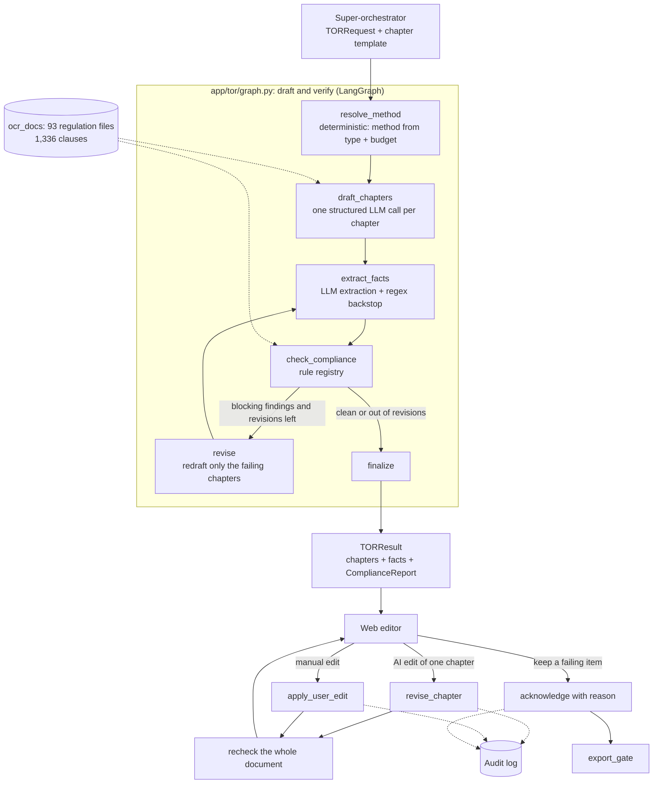

# DraftTOR Agent: TOR drafting and procurement-compliance checking

[](https://www.python.org/downloads/)
[](https://github.com/langchain-ai/langgraph)
[](https://opensource.org/licenses/MIT)

DraftTOR Agent drafts Thai government Terms of Reference (ร่างขอบเขตของงาน, TOR) and checks them against procurement law (พ.ร.บ.การจัดซื้อจัดจ้างและการบริหารพัสดุภาครัฐ พ.ศ. ๒๕๖๐ and ระเบียบกระทรวงการคลังฯ ๒๕๖๐). It is one workflow in a Procurement Agentic SaaS: a **super-orchestrator** sends it the project details and the chapter template, and it returns the drafted chapters together with a compliance report.

The pipeline does two jobs:

1. **Write** each chapter the template asks for.
2. **Verify** the whole document against a rule registry in which every rule is tied to a clause in the regulation corpus. Users then edit the document in the web app. The system re-checks after every edit and reports problems, but never overrides the user. Any blocking finding the user chooses to keep must be acknowledged with a reason, and that acknowledgement is audit-logged.

> TOR drafting lives in `app/tor/`. The fixed 7-section TOR pipeline it replaced has been removed. The Memo and Meeting Agenda pipelines in `app/graphs/` are unchanged.

---

## Architecture



### Components

| Module | Responsibility |
|---|---|
| [app/tor/schemas.py](app/tor/schemas.py) | Contracts: `TORRequest` (input from the orchestrator), `TORTemplateSpec` / `TemplateChapter`, `DraftChapter`, `TORFacts`, `Finding`, `ComplianceReport`, `TORResult` |
| [app/tor/procurement.py](app/tor/procurement.py) | Chooses the procurement method (e-bidding / e-market / specific / selection) deterministically. The LLM never decides legal thresholds. |
| [app/tor/regulations.py](app/tor/regulations.py) | Splits the OCR corpus into clauses (`มาตรา` / `ข้อ`). Exact clause lookup supports citations; character-trigram BM25 supplies drafting context. Thai text has no word boundaries, so trigrams avoid needing a tokenizer. |
| [app/tor/drafting.py](app/tor/drafting.py) | Drafts each chapter as JSON validated by Pydantic. All money arithmetic runs in Python: the LLM proposes BOQ categories and weights, and the code allocates the budget exactly. Fact extraction uses the LLM with a regex backstop. |
| [app/tor/checks.py](app/tor/checks.py) | Check implementations and the runner. |
| [app/tor/rules/tor_rules.yaml](app/tor/rules/tor_rules.yaml) | Rule registry: severity, scope (procurement type and method), citation, `verified` flag, parameters. |
| [app/tor/service.py](app/tor/service.py) | Operations after generation: `revise_chapter`, `apply_user_edit`, `recheck`, `acknowledge`, `export_gate`, `AuditLog`. |

### Compliance rules

| Kind | Rules | How it is checked |
|---|---|---|
| Internal consistency | chapters complete, no fallback text, BOQ total equals budget, installments total 100%, installments ordered and within the contract duration | Pure Python |
| Legal, numeric | daily penalty rate (ระเบียบฯ ข้อ ๑๖๒), contract bond 5–10% (ข้อ ๑๖๘), subcontracting penalty ≥ 10% (มาตรา ๙๕), wording consistent with the procurement method (มาตรา ๕๕) | Facts extracted, then checked in Python |
| Legal, semantic | no brand or vendor lock in specifications (มาตรา ๙); vendor qualifications proportionate to the work (มาตรา ๘) | LLM judge, given the exact clause text and the agency's own requirements, with a grounding guard (below) |
| Pending expert sign-off | reference-work value ≤ 50% of budget; budget cap for the specific method | Report `needs_human`; never `fail` |

**Design principles**

- **Every rule cites a real clause.** A unit test confirms each citation resolves to a clause in `ocr_docs`.
- **Unverified rules cannot block.** Until a procurement expert sets `verified: true`, a rule can report `needs_human` but never `fail`.
- **Missing data is never a silent pass.** If a required fact is absent, the check reports `warn`. If the extractor itself failed, it reports `needs_human`.
- **Grounding guard on the LLM judge.** The judge must quote the offending text. If the quote does not appear in the draft, the finding is discarded and the item is routed to `needs_human`.
- **Users stay in charge after generation.** A user's edits are re-checked and reported, never auto-corrected. Exporting with blocking findings requires an `acknowledge` with a reason, recorded in the audit log.

---

## Usage

**From the super-orchestrator:** call `draft_and_verify_tor(TORRequest)` from `app.tor`. The request contains:

- the project details: name, agency, budget, duration and raw requirements;
- the procurement type;
- optionally, the procurement method. If it is omitted, the method is resolved deterministically.
- a `TORTemplateSpec`, which lists the chapters. Each chapter has an `id`, `title`, `kind` (`text`, `list`, `boq` or `payment_schedule`), optional `instructions`, and a `required` flag.

The call returns a `TORResult` containing the structured chapters, the extracted facts, and a `ComplianceReport`. Each finding in the report has `rule_id`, `status`, `evidence`, `suggestion` and `citation`.

**After generation (web editor):** all four functions are in `app.tor`.

| Function | When to use it |
|---|---|
| `revise_chapter(result, chapter_id, instruction, actor)` | The user asks the AI to change one chapter. Other chapters stay as they are, and the whole document is re-checked. |
| `apply_user_edit(result, chapter, actor)` | The user edits a chapter by hand. The whole document is re-checked; the result is advisory only. |
| `export_gate(result)` | Returns the blocking findings that have not been acknowledged. An empty list means the document can be exported. |
| `acknowledge(result, finding_keys, actor, reason)` | The user accepts responsibility for specific findings. A reason is required. |

The audit log is written to `data/audit/<document_id>.jsonl` as one event per line: `generated`, `ai_revision`, `user_edit`, `acknowledge`. In production, replace it with a database table.

---

## Evaluation

There are two layers.

**1. Unit tests (offline, stub LLM, real regulation corpus): 18 tests** in `tests/test_tor_compliance.py`. Run them with pytest.

They cover rule and citation resolution, each deterministic check, the judge grounding guard, the draft → check → revise loop, the revision limit, revise-chapter isolation, and the acknowledgement lifecycle.

**2. Evaluation against the real LLM: [scripts/eval_tor_compliance.py](scripts/eval_tor_compliance.py)**. Pass `--suites A,B,C` and `--runs N`. The full report is written to `data/eval/tor_eval_<timestamp>.json`.

| Suite | What it measures |
|---|---|
| **A: checker** | 14 TORs seeded with known defects (recall), 6 compliant near-miss TORs that look suspicious (false positives), and 1 clean baseline. Includes subtle cases: CPU model naming, iOS/Lightning lock, location restrictions, excessive registered capital. |
| **B: end-to-end** | Three requests drafted from scratch (services via e-bidding 3.5M, goods via the specific method 300k, consulting 2M). Measures pass rate, revisions, fallback chapters, latency and LLM calls. |
| **C: chapter revision** | Whether the instruction was followed, whether other chapters stayed unchanged, and whether a non-compliant user instruction is still obeyed but flagged. |

### Results: `qwen/qwen3.5-9b` via OpenRouter, 3 runs per suite

Each column is one development iteration, measured with the same evaluation script.

| Metric | Run 1: baseline | Run 2: bug fixes | Run 3: parallel (4 workers) | **Final** |
|---|---|---|---|---|
| A: recall on seeded defects | 92.9% | 92.9% | 90.5% | **100%** (42/42) |
| A: semantic (brand lock, qualifications) | 100% | 100% | 81% | **100%** |
| A: numeric facts | 75% | 75% | 100% | **100%** |
| A: false positives on near-misses | 0% | 5.6% | 0% | **0%** (0/18) |
| A: false positives on the clean baseline | 0/3 | 0/3 | 0/3 | **0/3** |
| B: end-to-end pass rate | 0/9 | 8/9 | 9/9 | **8/9** |
| B: mean revisions per TOR | 2.0 | 1.0 | 1.0 | **0.44** |
| B: median latency per TOR | ~120 s | ~65 s | ~34 s | **~34 s** (mean 71 s, see below) |
| B: mean LLM calls per TOR | 23.8 | 15.0 | 18.3 | 17.2 |
| C: instruction followed / other chapters untouched | 3/3 / 3/3 | 2/3 / 3/3 | 3/3 / 3/3 | **3/3 / 3/3** |
| C: non-compliant user edit (brand name) flagged | 1/1 | 0/1 | 1/1 | 0/1 |

### What changed between runs

| Run | Problem found | Fix |
|---|---|---|
| 1 → 2 | When the LLM extractor failed, the bond check **passed silently** | Regex backstop for numeric facts. Missing facts now report `warn`, or `needs_human` if extraction failed. |
| 1 → 2 | Retrieval pulled a contract template (a rented-car clause) into a software TOR | Retrieval limited to the Act and the Ministry of Finance regulation; prompt forbids copying unrelated text |
| 1 → 2 | The judge flagged a "3-year warranty" that the agency itself asked for | The judge now receives the agency's requirements; the qualification rule is limited to qualification chapters |
| 2 → 3 | A user instruction naming a brand was refused | Drafting constraints are dropped when the user gives an explicit instruction. The checker reports, the user decides. |
| 2 → 3 | Reference-work value was never extracted | Regex backstop for amounts written with commas or Thai digits |
| 2 → 3 | Fully sequential LLM calls | Parallel chapter drafting and revision, facts and judges run concurrently, global limit of 4 LLM requests, judge verdicts cached per chapter |
| 3 → final | Judging one chapter at a time hid the project budget; the open-ended "any violations?" question missed capital and location restrictions (0/5) | Project context added to the judge prompt; the qualification rule now uses a **per-item checklist**, so the model must answer every item. This raised those cases to 5/5 and 4/5 in a targeted 50-sample test, and 3/3 in the final run. |

**Reading the final run**

- **The checker is reliable on this test set:** every seeded defect was caught, with no false positives on near-misses or on the clean TOR.
- **One remaining end-to-end failure:** the drafter still sometimes writes e-bidding wording in a specific-method TOR. The checker catches it, but two revision rounds did not fix it.
- **Latency is dominated by tail requests:** typical TORs take 11–52 s, but one took 402 s because of slow or failed requests (40 s timeout, then fallback model). The fix is a shorter timeout plus retry or hedged requests (not done yet).
- **Brand-lock detection after a user edit is not stable:** a user-requested brand name was flagged in 2 of the 4 runs. Converting the brand-lock rule to the checklist format is the likely fix.
- **Small sample:** the test set has 14 defect cases and 6 near-misses, written by us. These results show the mechanism works, not real-world accuracy.

---

## Known limitations and next steps

- **Missing sources:** the corpus lacks the ministerial regulation on budget caps for the specific method (กฎกระทรวงกำหนดวงเงินฯ ๒๕๖๐) and the circular on the reference-work cap, so both rules stay `verified: false`.
- **Expert sign-off:** a procurement officer must sign off every rule parameter before setting `verified: true`. The OCR of ข้อ ๑๖๒ is partly garbled, so the "ไม่ต่ำกว่าวันละ ๑๐๐ บาท" minimum is not encoded yet.
- **Unstable LLM judge:** verdicts are now cached per chapter, but a 9B model still varies between runs. Next steps: switch the brand-lock rule to the checklist format, use a larger judge model, or run self-consistency voting.
- **Specific-method wording:** the drafter can still write e-bidding wording. Consider a deterministic rewrite or a stronger method-specific prompt.
- **Tail latency:** most TORs finish in about 34 s, but slow requests (40 s timeout, then fallback model) can push one past 400 s. Add a shorter timeout with retry or hedged requests.
- **No `.docx` output yet:** the new pipeline returns structured data. A renderer for variable chapter templates is still to do.
- **Adversarial set:** the seeded defects were written by us. A set curated by procurement officers is needed to measure real-world recall.

---

## Project structure

```
DraftTOR_Agent/
├── app/
│   ├── tor/                      # Template-driven TOR drafting and compliance (current)
│   │   ├── graph.py              #   LangGraph: draft → verify → revise
│   │   ├── concurrency.py        #   4-request LLM limit, parallel map, judge cache
│   │   ├── service.py            #   revise_chapter / apply_user_edit / acknowledge / export_gate / AuditLog
│   │   ├── drafting.py           #   structured chapter drafting, BOQ allocation, fact extraction
│   │   ├── checks.py             #   rule runner, deterministic checks, grounded LLM judge
│   │   ├── regulations.py        #   clause index over ocr_docs (exact lookup + trigram BM25)
│   │   ├── procurement.py        #   deterministic method resolution
│   │   ├── llm.py                #   JSON → Pydantic with one retry carrying the validation error
│   │   ├── schemas.py
│   │   └── rules/tor_rules.yaml  #   rule registry (versioned)
│   ├── graphs/                   # Memo and Meeting Agenda pipelines (legacy)
│   ├── schemas/  services/  templates/  assets/
├── ocr_docs/typhoon_ocr/         # Regulation corpus (Act, MoF regulation, ministerial regulations, announcements)
├── data/
│   ├── ground_truth/             # DGA TOR PDFs and parsed JSON
│   ├── templates/raw/            # TOR and memo source templates
│   ├── eval/                     # Evaluation reports (git-ignored)
│   └── audit/                    # Audit logs (git-ignored)
├── scripts/
│   ├── eval_tor_compliance.py    # Evaluation against the real LLM (suites A/B/C)
│   └── data_prep/                # Corpus download, ground-truth extraction, docx template builders
├── tests/
│   ├── test_tor_compliance.py    # Current pipeline (offline)
│   └── test_evaluation_suite.py  # Memo / Agenda pipelines (calls the LLM)
```

## Configuration

Copy `env.example` to `.env`. Variables:

| Variable | Default | Purpose |
|---|---|---|
| `LLM_BASE_URL` / `OPENROUTER_API_KEY` / `LLM_MODEL_NAME` | OpenRouter / – / `qwen/qwen3.5-9b` | Any OpenAI-compatible endpoint (OpenRouter for development, vLLM on-premise) |
| `REGULATION_CORPUS_DIR` | `ocr_docs/typhoon_ocr` | Regulation corpus |
| `TOR_RULES_PATH` | `app/tor/rules/tor_rules.yaml` | Rule registry |
| `TOR_MAX_REVISIONS` | `2` | Revision budget for the automatic draft-and-revise loop |
| `TOR_AUDIT_DIR` | `data/audit` | Audit log location |

## License

MIT. See [LICENSE](LICENSE).
