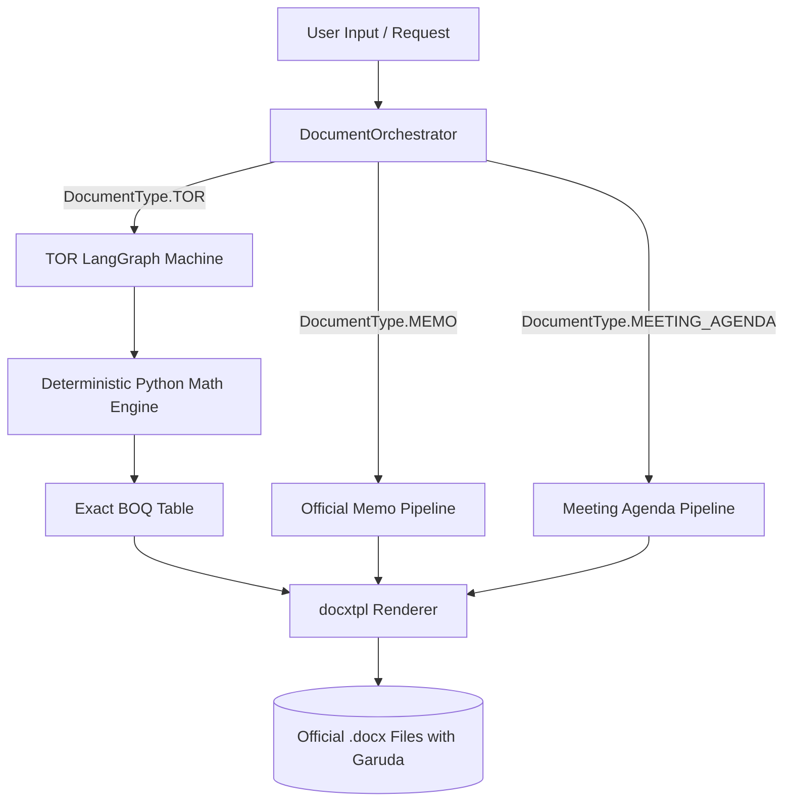

# 🏛️ DraftTOR Agent: Thai Government Multi-Document Drafting Engine

[](https://www.python.org/downloads/)
[](https://github.com/langchain-ai/langgraph)
[](https://opensource.org/licenses/MIT)
[](#-evaluation-scorecard)

An AI-powered agentic system engineered to draft fully compliant, legally sound, and properly formatted **official Thai Government documents (.docx)** from raw user requests.

Built with **LangGraph**, **Pydantic**, and **docxtpl**, the system strictly adheres to the **Office of the Prime Minister's Regulations on Office Material B.E. 2526 (ระเบียบงานสารบรรณ พ.ศ. ๒๕๒๖)** and the **Public Procurement and Supplies Administration Act B.E. 2560 (พ.ร.บ.การจัดซื้อจัดจ้างและการบริหารพัสดุภาครัฐ พ.ศ. ๒๕๖๐)**.

---

## 🌟 Key Features

- **Multi-Document Support**: Drafts Terms of Reference (TOR), Internal Memorandums (บันทึกข้อความ), and Meeting Agendas (ระเบียบวาระการประชุม) through a unified dispatcher.
- **Official Garuda Emblem Placement**:
  - **3.0 cm** centered for External Documents & TOR.
  - **1.5 cm** top-left for Internal Memorandums (บันทึกข้อความ).
- **100% Deterministic Financial Arithmetic**: Eliminates LLM math hallucinations in Bill of Quantities (BOQ) tables. The sum of all itemized breakdown costs always equals the total project budget exactly (0.00 cent discrepancy).
- **Bureaucratic Typography & Margins**: Formatted in **TH Sarabun PSK 16pt** with standard Thai government margins (Top 2.5 cm, Bottom 2.0 cm, Left 3.0 cm, Right 2.0 cm).
- **Automated 5-Gate Evaluation Suite**: Comprehensive automated test gates evaluating structure, math integrity, physical asset embedding, legal compliance, and scratchpad leakage.

---

## 📑 Supported Government Documents

| Document Type | Thai Title | Core Regulation / Standard | Hard Edge Cases Handled |
| :--- | :--- | :--- | :--- |
| **TOR** | ร่างขอบเขตของงาน (จัดซื้อจัดจ้าง) | พ.ร.บ. จัดซื้อจัดจ้างฯ 2560 | 3.0cm Garuda, 7 standard sections, dynamic BOQ table with exact math, Sec. 64 vendor qualifications. |
| **MEMO** | บันทึกข้อความ (หนังสือภายใน) | ระเบียบงานสารบรรณ 2526 | 1.5cm Garuda top-left, 3-part structure (ต้นเรื่อง, ข้อพิจารณา, ข้อเสนอ "จึงเรียนมาเพื่อโปรด..."). |
| **MEETING_AGENDA** | ระเบียบวาระการประชุม | มาตรฐานการประชุมราชการ | 5 standard agendas (ประธานแจ้ง, รับรองรายงาน, เพื่อทราบ, เพื่อพิจารณา, อื่นๆ). |

---

## 🏗️ Architecture Overview



---

## 📊 Evaluation Scorecard

All generated documents pass our automated 5-Gate test suite (`tests/test_evaluation_suite.py`):

```
================================================================================
GOVERNMENT DOCUMENT AI EVALUATION SCORECARD
================================================================================
Document Type | Evaluation Metric                        | Status   | Details
--------------------------------------------------------------------------------
TOR          | Structural Completeness                  | [PASS]   | 7 sections complete, 12 scope items
TOR          | Financial Integrity (100% Math)          | [PASS]   | Budget: THB 3,500,000.00 == BOQ Sum: THB 3,500,000.00
TOR          | Garuda & Dynamic Table Rendering         | [PASS]   | Garuda verified. Table has 5 rows
TOR          | Public Procurement Act 2560 Compliance   | [PASS]   | Mandatory vendor qualification & evaluation criteria verified
MEMO         | Saraban Header Adherence                 | [PASS]   | agency, doc_number, date, subject, recipient intact
MEMO         | 3-Part Bureaucratic Content Structure    | [PASS]   | Background, Considerations, and Action conform to Saraban
MEMO         | Garuda Emblem Embedded                   | [PASS]   | 1.5cm Garuda emblem verified in docx
MEMO         | Clean Text / Zero Hallucination Scratchpad | [PASS]   | No LLM scratchpad or reasoning leakage
AGENDA       | Standard 5-Agendas Format                | [PASS]   | Agendas 1 to 5 fully conform to meeting standards
AGENDA       | Meeting Agenda Docx Rendered             | [PASS]   | Docx generated (12 paragraphs)
--------------------------------------------------------------------------------
Total Tests: 10 | Passed: 10 | Pass Rate: 100.0% (Execution Time: 31.28s)
================================================================================
```

---

## 🚀 Quick Start

### 1. Clone & Install Dependencies

```bash
git clone https://github.com/your-username/DraftTOR_Agent.git
cd DraftTOR_Agent

python -m venv .venv
# On Windows:
.venv\Scripts\activate
# On Linux/macOS:
# source .venv/bin/activate

pip install -r requirements.txt
```

### 2. Configure Environment

Copy `env.example` to `.env` and fill in your OpenRouter API key:

```bash
cp env.example .env
```

```ini
OPENROUTER_API_KEY="your-openrouter-api-key"
LLM_MODEL_NAME="qwen/qwen3.5-9b"
LLM_BASE_URL="https://openrouter.ai/api/v1"
OUTPUT_DIR="data/outputs"
TEMPLATE_DIR="app/templates"
```

### 3. Run the Automated Evaluation Suite

```bash
python tests/test_evaluation_suite.py
```

### 4. Programmatic Usage Example

```python
from app.schemas.gov_documents import DocumentType, TORInputRequest
from app.graphs.document_orchestrator import document_orchestrator

# Define your project requirements
request = TORInputRequest(
    project_name="โครงการพัฒนาระบบสืบค้นข้อมูลอัจฉริยะ (AI Smart Search)",
    agency_name="สำนักงานพัฒนารัฐบาลดิจิทัล (องค์การมหาชน)",
    budget=3500000.00,
    raw_requirements="พัฒนาระบบ AI Semantic Search เพื่อสืบค้นเอกสารราชการและมติ ครม. พร้อม UAT และฝึกอบรม",
    duration_days=365
)

# Generate official .docx
result = document_orchestrator.draft_document(DocumentType.TOR, request)
print(f"Generated Document: {result['output_docx_path']}")
```

Generated `.docx` files will be saved in `data/outputs/`.

---

## 📁 Project Structure

```
DraftTOR_Agent/
├── app/
│   ├── assets/
│   │   └── garuda.png             # Authentic Thai Government Garuda emblem
│   ├── graphs/
│   │   ├── document_orchestrator.py # Unified multi-document dispatcher
│   │   ├── workflow.py            # TOR LangGraph state machine
│   │   ├── memo_workflow.py       # Official Memorandum pipeline
│   │   ├── agenda_workflow.py     # Meeting Agenda pipeline
│   │   ├── nodes.py               # Section drafters & deterministic math engine
│   │   └── state.py               # Graph state definitions
│   ├── schemas/
│   │   └── gov_documents.py       # Pydantic models for TOR, Memo, Agenda
│   ├── services/
│   │   ├── docx_renderer.py       # docxtpl rendering engine
│   │   ├── fewshot_store.py       # Ground truth few-shot reference repository
│   │   └── llm_factory.py         # OpenRouter client with reasoning control
│   └── templates/                 # Word templates with TH Sarabun PSK 16pt
│       ├── tor_template.docx
│       ├── memo_template.docx
│       └── meeting_agenda_template.docx
├── data/
│   ├── ground_truth/              # DGA official IT project TOR PDFs & JSON
│   └── outputs/                   # Generated .docx documents
├── docs/
│   ├── ARCHITECTURE.md            # In-depth system architecture & edge cases
│   ├── EVALUATION.md              # 5-Gate evaluation framework & scorecard
│   └── USAGE_GUIDE.md             # Code recipes for each document type
├── tests/
│   └── test_evaluation_suite.py   # Multi-document automated test suite
├── .gitignore
├── env.example
├── requirements.txt
└── README.md
```

---

## 📚 Detailed Documentation

- [Strategic Plan & Roadmap](docs/PLAN.md)
- [System Architecture & Edge Cases](docs/ARCHITECTURE.md)
- [Evaluation Framework & Scorecard](docs/EVALUATION.md)
- [Usage Guide & Code Recipes](docs/USAGE_GUIDE.md)

---

## 📄 License

This project is licensed under the MIT License - see the [LICENSE](LICENSE) file for details.
