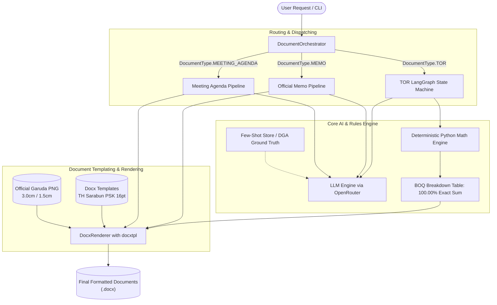

# 🏛️ System Architecture: Thai Government Multi-Document Drafting Engine

## 1. Overview
The **Thai Government Document Drafting Agent** is an enterprise-grade agentic system designed to automatically draft compliant, legally sound, and properly formatted official Thai government documents (.docx) from raw user requirements.

Unlike standard LLM generation pipelines, this engine addresses real-world government document complexities:
- **Strict Bureaucratic Typography & Margins**: Adheres to the Office of the Prime Minister's Regulations on Office Material B.E. 2526 (ระเบียบสำนักนายกรัฐมนตรีว่าด้วยงานสารบรรณ พ.ศ. ๒๕๒๖) and TH Sarabun PSK 16pt standards.
- **Physical Asset Embedding (Garuda Emblem)**: Accurate dimensions and placement (3.0 cm centered for TOR/external docs vs. 1.5 cm top-left for internal memos).
- **100% Deterministic Financial Arithmetic**: Guaranteed mathematical consistency for cost breakdowns and Bill of Quantities (BOQ).
- **Multi-Document Support**: Central dispatcher routing to specialized pipelines for TORs, Internal Memos, and Meeting Agendas.

---

## 2. High-Level System Architecture

---

## 3. Supported Document Types & Specifications

### 1. Terms of Reference (TOR / ข้อกำหนดและขอบเขตของงาน)
- **Governing Law**: Public Procurement and Supplies Administration Act B.E. 2560 (พ.ร.บ.การจัดซื้อจัดจ้างและการบริหารพัสดุภาครัฐ พ.ศ. ๒๕๖๐).
- **Emblem**: 3.0 cm Garuda placed at the top-center.
- **Structure (7 Core Sections)**:
  1. `background_and_rationale`: Background and rationale referencing national strategy or institutional mission.
  2. `objectives`: Bulleted project objectives ("เพื่อ...").
  3. `budget_breakdown`: Dynamic BOQ table with line items, quantities, unit prices, and line totals.
  4. `vendor_qualifications`: Mandatory statutory qualifications under Section 64 + domain-specific technical criteria.
  5. `scope_of_work`: Step-by-step deliverable scope (design, development, UAT, deployment, training, SLA).
  6. `deliverables_and_payments`: Phased installment table summing to 100%.
  7. `evaluation_criteria`: Price Performance scoring (e.g., 70% Quality / 30% Price).

### 2. Memorandum (บันทึกข้อความ / หนังสือภายใน)
- **Governing Law**: Prime Minister's Office Saraban Regulations B.E. 2526.
- **Emblem**: 1.5 cm Garuda placed at top-left.
- **Structure (3-Part Bureaucratic Flow)**:
  - Header: ส่วนราชการ (Agency/Div), ที่ (Doc No.), วันที่ (Thai Date), เรื่อง (Subject), เรียน (Recipient).
  - Part 1: ความเป็นมา/ต้นเรื่อง (Background - "ด้วย...", "ตามที่...").
  - Part 2: ข้อเท็จจริงและข้อพิจารณา (Facts & Considerations).
  - Part 3: ข้อเสนอเพื่อสั่งการ (Action Request - "จึงเรียนมาเพื่อโปรดพิจารณา...").
  - Sign-off: Position and Name block.

### 3. Meeting Agenda (ระเบียบวาระการประชุม)
- **Standard 5-Agenda Layout**:
  - วาระที่ ๑: เรื่องที่ประธานแจ้งให้ที่ประชุมทราบ (Chairman's opening remarks)
  - วาระที่ ๒: เรื่องรับรองรายงานการประชุมครั้งที่ผ่านมา (Adoption of previous minutes)
  - วาระที่ ๓: เรื่องสืบเนื่อง / เรื่องเพื่อทราบ (Matters arising & matters for information)
  - วาระที่ ๔: เรื่องเสนอเพื่อพิจารณา (Matters for committee consideration)
  - วาระที่ ๕: เรื่องอื่นๆ (Other matters)

---

## 4. Key Engineering Solutions

### A. Non-Hallucinatory BOQ Arithmetic
LLMs frequently hallucinate floating-point arithmetic (e.g. `1,250,000 + 800,000 + 450,000 != 2,500,000`).
To eliminate financial errors:
1. LLM proposes category names appropriate to the project domain.
2. Python's deterministic math layer calculates proportions, unit prices, and quantities.
3. The final line item is adjusted by `item_total = budget - allocated` ensuring the sum equals the budget with **0.00 cent discrepancy**.

### B. `docxtpl` Dynamic Table Row Rendering
To render dynamic tables without corrupting Word document XML, delimiter rows are utilized:
- **Header Row**: Styled with `#E8EEF5` shading and TH Sarabun PSK Bold.
- **Row 1**: ``
- **Row 2 (Data)**: `{{ loop.index }}`, `{{ item.name }}`, `{{ item.qty }}`, `{{ item.unit }}`, `{{ item.unit_price }}`, `{{ item.total_price }}`
- **Row 3**: ``
When rendered, `docxtpl` strips the delimiter rows and cleanly stamps the table rows.

### C. OpenRouter Reasoning Model Handling
When using reasoning models (such as `qwen/qwen3.5-9b`):
- The API call enforces `extra_body={"reasoning": {"effort": "none"}}`.
- This prevents the model from spending thousands of reasoning tokens inside scratchpads, reducing execution time from **>120s down to ~25s** and preventing `<think>` markdown leakage into official documents.
