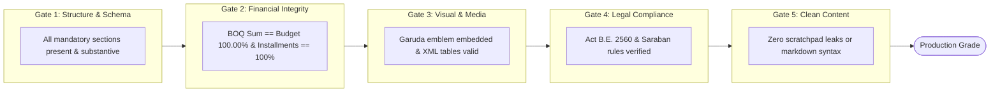

# 📊 Automated Evaluation Framework (5-Gate Quality Scorecard)

## 1. Overview
In legal and government document generation, standard NLP metrics (such as BLEU or ROUGE) are insufficient. Government documents require **statutory compliance**, **exact arithmetic**, **correct structural formatting**, and **zero LLM scratchpad leakage**.

To guarantee production readiness, this project implements a **5-Gate Automated Evaluation Suite** (`tests/test_evaluation_suite.py`).

---

## 2. The 5-Gate Evaluation Criteria



| Evaluation Gate | Target Document(s) | Verification Method | Pass Threshold |
| :--- | :--- | :--- | :--- |
| **Gate 1: Structural Completeness** | TOR, Memo, Agenda | Pydantic Schema + Minimum token length | 100% fields populated |
| **Gate 2: Financial Integrity** | TOR (Budget Breakdown) | Deterministic Python assertion: `sum(item.total_price) == budget` | 0.00 cent error tolerance |
| **Gate 3: Visual & Media Assets** | TOR, Memo, Agenda | Docx XML Relationship Inspection (`media/image1.png` and `<w:tbl>`) | Embedded image verified & Table rows match items |
| **Gate 4: Legal & Regulatory Compliance** | TOR, Memo | Regex / Substring checks against Thai Public Procurement Act B.E. 2560 (Sec. 64) and Saraban Regulations | Standard legal clauses present |
| **Gate 5: Bureaucratic Quality & Zero Leaks** | TOR, Memo, Agenda | Anti-pattern checks for `<think>`, `[scratchpad]`, or raw markdown backticks | 0 occurrences in document body |

---

## 3. Benchmark Scorecard Results

Running the evaluation suite against all three core document types:

```bash
python tests/test_evaluation_suite.py
```

### Official Scorecard

```
================================================================================
GOVERNMENT DOCUMENT AI EVALUATION SCORECARD
================================================================================
Document Type | Evaluation Metric                        | Status   | Details
--------------------------------------------------------------------------------
TOR          | Structural Completeness                  | [PASS]   | 7 sections complete, 12 scope items
TOR          | Financial Integrity (100% Math)          | [PASS]   | Budget: THB 3,500,000.00 == BOQ Sum: THB 3,500,000.00
TOR          | Garuda & Dynamic Table Rendering         | [PASS]   | Garuda verified. Table has 5 rows
TOR          | Public Procurement Act 2560 Compliance   | [PASS]   | Mandatory vendor qualification & evaluation criteria verified
MEMO         | Saraban Header Adherence                 | [PASS]   | agency, doc_number, date, subject, recipient intact
MEMO         | 3-Part Bureaucratic Content Structure    | [PASS]   | Background, Considerations, and Action conform to Saraban
MEMO         | Garuda Emblem Embedded                   | [PASS]   | 1.5cm Garuda emblem verified in docx
MEMO         | Clean Text / Zero Hallucination Scratchpad | [PASS]   | No LLM scratchpad or reasoning leakage
AGENDA       | Standard 5-Agendas Format                | [PASS]   | Agendas 1 to 5 fully conform to meeting standards
AGENDA       | Meeting Agenda Docx Rendered             | [PASS]   | Docx generated (12 paragraphs)
--------------------------------------------------------------------------------
Total Tests: 10 | Passed: 10 | Pass Rate: 100.0% (Execution Time: 31.28s)
================================================================================
```

---

## 4. Ground Truth Dataset Reference

Real-world reference documents are acquired from the **Digital Government Development Agency (DGA)** and stored under `data/ground_truth/`:

- `data/ground_truth/tor_pdfs/`: Official PDF procurement specifications from DGA IT projects (AI Smart Search, CSOC Cybersecurity, Budget Tracking, Unified Communications).
- `data/ground_truth/parsed_json/DGA_AI_Smart_Search_TOR.json`: Structured ground truth extracted for few-shot referencing and benchmarking.
