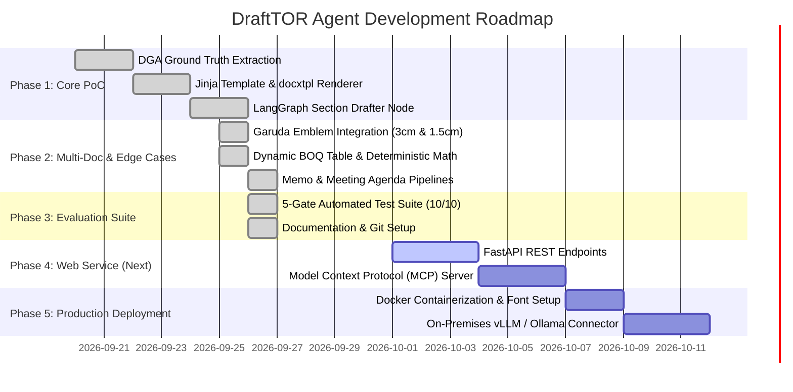

# 📋 Strategic Plan: Thai Government Multi-Document Drafting Engine (DraftTOR Agent)

## 1. Project Vision & Goals
The **DraftTOR Agent** is an enterprise-grade agentic AI service designed to automate the drafting of official Thai government documents (.docx) strictly following:
1. **The Office of the Prime Minister's Regulations on Office Material B.E. 2526** (ระเบียบสำนักนายกรัฐมนตรีว่าด้วยงานสารบรรณ พ.ศ. ๒๕๒๖).
2. **The Public Procurement and Supplies Administration Act B.E. 2560** (พ.ร.บ.การจัดซื้อจัดจ้างและการบริหารพัสดุภาครัฐ พ.ศ. ๒๕๖๐).
3. **Official Bureaucratic Formatting Standards**: TH Sarabun PSK 16pt, official margins (Top 2.5 cm, Bottom 2.0 cm, Left 3.0 cm, Right 2.0 cm), and authentic Garuda emblem placement.

---

## 2. Phased Implementation Roadmap



### ✅ Phase 1: Core Engine & PoC (Completed)
- [x] Analyzed DGA official procurement documents to extract ground truth structures.
- [x] Designed Pydantic data schemas for government documents.
- [x] Implemented LangGraph state machine looping through 7 distinct sections with low token overhead.
- [x] Built `docx_renderer` using `docxtpl` for Jinja-based Word document rendering.

### ✅ Phase 2: Multi-Document Expansion & Hard Edge Cases (Completed)
- [x] **Garuda Emblem Placement**:
  - 3.0 cm centered emblem for external documents & TOR.
  - 1.5 cm top-left emblem inside a header table for internal memos (บันทึกข้อความ).
- [x] **Dynamic BOQ Table & Deterministic Arithmetic**:
  - LLM extracts domain-specific cost items.
  - Python calculation engine enforces `sum(item.total_price) == budget` (0.00 cent discrepancy).
- [x] **Multi-Document Support**:
  - Extended to **Official Memorandum** (3-part Saraban: ต้นเรื่อง, ข้อพิจารณา, ข้อเสนอ).
  - Extended to **Meeting Agenda** (5 standard agendas).
  - Unified dispatcher pattern via `DocumentOrchestrator`.

### ✅ Phase 3: Automated Evaluation Suite (Completed)
- [x] Implemented **5-Gate Evaluation Suite** (`tests/test_evaluation_suite.py`):
  1. Structural Completeness & Schema Validation.
  2. Financial & Mathematical Integrity (100% exact math).
  3. Visual & Media Assets (physical Garuda image & XML tables verified).
  4. Legal & Regulatory Compliance (Act B.E. 2560 & Saraban rules).
  5. Clean Text (zero LLM scratchpad or reasoning leakage).
- [x] Achieved **100% Pass Rate (10/10 metrics)** across all document types in ~31 seconds.

### ⏳ Phase 4: Production Web Service (Planned Next)
- [ ] **FastAPI REST API**:
  - `POST /api/v1/documents/draft`: Async document generation endpoint.
  - `GET /api/v1/documents/download/{task_id}`: Binary streaming for `.docx` downloads.
  - Interactive Swagger UI (`/docs`).
- [ ] **Model Context Protocol (MCP) Server**:
  - Expose tools (`draft_government_tor`, `draft_internal_memo`, `draft_meeting_agenda`) over STDIO and SSE transports for Cursor, Claude Desktop, and Agentic IDEs.

### ⏳ Phase 5: Containerization & Deployment (Planned)
- [ ] Multi-stage `Dockerfile` with Thai OS fonts (`fonts-thai-tlwg`) pre-installed.
- [ ] Volume persistence for generated documents and templates.
- [ ] Support on-premises deployment via local OpenAI-compatible backends (vLLM / Ollama) without external API dependencies.

---

## 3. System Architecture & Components

```
DraftTOR_Agent/
├── app/
│   ├── assets/
│   │   └── garuda.png               # Official Thai Government Garuda Emblem
│   ├── config.py                     # Pydantic Settings & environment loader
│   ├── graphs/
│   │   ├── document_orchestrator.py   # Master Dispatcher across all doc types
│   │   ├── workflow.py              # TOR LangGraph state machine
│   │   ├── memo_workflow.py         # Official Memorandum pipeline
│   │   ├── agenda_workflow.py       # Meeting Agenda pipeline
│   │   ├── nodes.py                 # Graph nodes & deterministic math engine
│   │   └── state.py                 # TypedDict pipeline states
│   ├── schemas/
│   │   └── gov_documents.py         # Pydantic schemas (TOR, Memo, Agenda, BOQ)
│   ├── services/
│   │   ├── docx_renderer.py         # docxtpl template populator
│   │   ├── fewshot_store.py         # DGA ground truth reference bank
│   │   └── llm_factory.py           # OpenRouter client with reasoning control
│   └── templates/                   # TH Sarabun PSK 16pt .docx templates
│       ├── tor_template.docx
│       ├── memo_template.docx
│       └── meeting_agenda_template.docx
├── data/
│   ├── ground_truth/                # DGA Real IT project PDFs & JSON
│   └── outputs/                     # Generated documents (.docx)
├── docs/
│   ├── PLAN.md                      # Strategic development plan & roadmap
│   ├── ARCHITECTURE.md              # In-depth architectural blueprint
│   ├── EVALUATION.md                # 5-Gate evaluation framework & scorecard
│   └── USAGE_GUIDE.md               # Code recipes & CLI execution guide
├── tests/
│   └── test_evaluation_suite.py     # Multi-document automated test suite
├── .gitignore                       # Repository security & cleanup
├── requirements.txt                 # Pinned Python dependencies
└── README.md                        # GitHub repository homepage
```

---

## 4. API & Interface Specifications (Phase 4 Design)

### A. REST API Endpoints (`app/main.py`)

#### 1. Draft Government Document
- **Endpoint**: `POST /api/v1/documents/draft`
- **Request Body**:
```json
{
  "document_type": "TOR",
  "data": {
    "project_name": "โครงการพัฒนาระบบสืบค้นข้อมูลอัจฉริยะ (AI Smart Search)",
    "agency_name": "สำนักงานพัฒนารัฐบาลดิจิทัล (องค์การมหาชน)",
    "budget": 3500000.0,
    "raw_requirements": "ระบบ AI Semantic Search...",
    "duration_days": 365
  }
}
```
- **Response**:
```json
{
  "status": "success",
  "document_type": "TOR",
  "file_id": "tor_draft_โครงการพ_ฒนาระบบส_บค_นข_อม_ลอ_.docx",
  "download_url": "/api/v1/documents/download/tor_draft_โครงการพ_ฒนาระบบส_บค_นข_อม_ลอ_.docx"
}
```

#### 2. Download File
- **Endpoint**: `GET /api/v1/documents/download/{filename}`
- **Response**: `application/vnd.openxmlformats-officedocument.wordprocessingml.document` binary stream.

---

### B. Model Context Protocol (MCP) Tools

| MCP Tool Name | Description | Parameters |
| :--- | :--- | :--- |
| `draft_tor_document` | Drafts a complete 7-section TOR with exact BOQ table and 3cm Garuda | `project_name`, `agency_name`, `budget`, `raw_requirements`, `duration_days` |
| `draft_memo_document` | Drafts an official Thai memorandum with 1.5cm Garuda and Saraban structure | `agency_name`, `subject`, `recipient`, `raw_context`, `action_request`, `signer_name`, `signer_position` |
| `draft_agenda_document` | Drafts a 5-agenda Thai government meeting document | `committee_name`, `meeting_no`, `meeting_year`, `meeting_date`, `meeting_time`, `raw_agenda_topics` |

---

## 5. Technology Stack & Deployment Strategy

| Component | Technology | Rationale |
| :--- | :--- | :--- |
| **Agent Orchestration** | LangGraph | Stateful sequential section drafting; prevents context window degradation. |
| **Data Validation** | Pydantic v2 | Strict type coercion and runtime validation. |
| **Document Engine** | docxtpl + python-docx | High-fidelity Jinja substitution preserving TH Sarabun styling and binary images. |
| **LLM Inference** | OpenRouter (`qwen/qwen3.5-9b`) / On-Prem vLLM | Fast Thai NLP capabilities with explicit reasoning control. |
| **Web Framework (Phase 4)** | FastAPI | Async high-performance REST APIs + OpenAPI documentation. |
| **Tool Integration (Phase 4)**| Model Context Protocol (MCP) | Seamless interoperability with IDEs and AI agent networks. |
| **Containerization (Phase 5)**| Docker + Linux (`fonts-thai-tlwg`) | Reproducible deployment across cloud or on-prem air-gapped government servers. |
